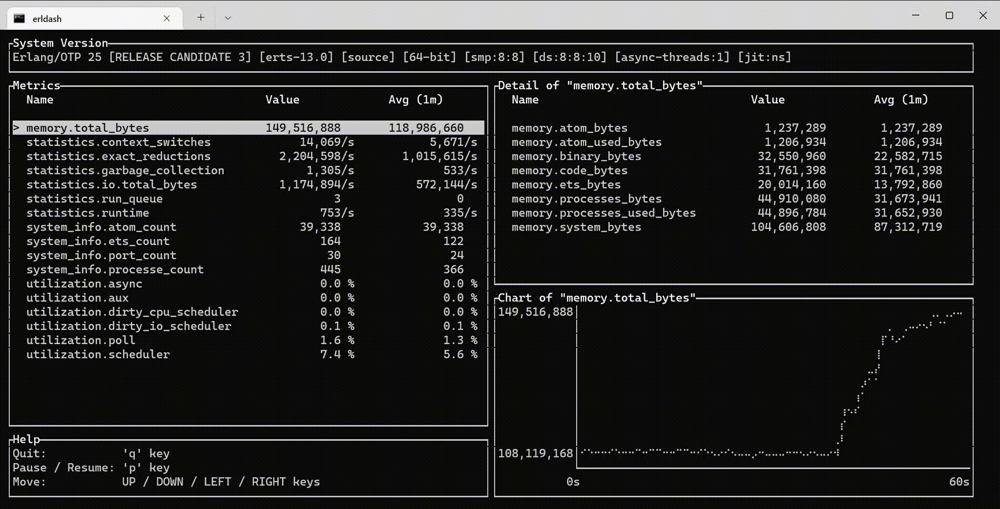

erldash
=======

[](https://crates.io/crates/erldash)
[](https://github.com/sile/erldash/actions)


A simple, terminal-based Erlang dashboard.

`erldash` connects to an Erlang node using [the dynamic node name feature] (since OTP-23) to collect metrics.
It only depends on [`erlang`] and [`erpc`] modules.
So you can use this dashboard out of the box without installing any additional packages to the target Erlang node.

Metrics are collected using [`erlang:statistics/1`], [`erlang:memory/0`] and [`erlang:system_info/1`] functions.



[the dynamic node name feature]: https://www.erlang.org/blog/otp-23-highlights/#dynamic-node-name
[`erlang`]: https://www.erlang.org/doc/man/erlang.html
[`erpc`]: https://www.erlang.org/doc/man/erpc.html
[`erlang:statistics/1`]: https://www.erlang.org/doc/man/erlang.html#statistics-1
[`erlang:memory/0`]: https://www.erlang.org/doc/man/erlang.html#memory-0
[`erlang:system_info/1`]: https://www.erlang.org/doc/man/erlang.html#system_info-1

Installation
------------

### Pre-built binaries

Pre-built binaries for Linux and MacOS are available in [the releases page](https://github.com/sile/erldash/releases).

```console
// An example to download the binary for Linux.
$ VERSION=...  # Set the target erldash version such as "0.1.2"
$ curl -L https://github.com/sile/erldash/releases/download/${VERSION}/erldash-${VERSION}.x86_64-unknown-linux-musl -o erldash
$ chmod +x erldash
$ ./erldash
```

### With [Cargo](https://doc.rust-lang.org/cargo/)

If you have installed `cargo` (the package manager for Rust), you can install `erldash` with the following command:
```console
$ cargo install erldash
$ erldash
```

Note that you need to use Rust-v1.58.0 or later to build `erldash`.

Usage
-----

Just execute the following command:

```console
$ erldash $TARGET_ERLANG_NODE
```

If you need to specify a cookie value other than `$HOME/.erlang.cookie`, please specify that to `--cookie` option.

`$ erldash --help` shows the detailed help message.
